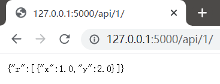

# Introduction
Deploy an algorithm service based on Python Flask.
# Install
```bash
pip install -r requirements.txt
```
# Usage
```
git clone https://github.com/XavierJiezou/flask-algorithm-deploy.git
cd flask-algorithm-deploy
python app.py
```
# Demo
```
http://127.0.0.1:5000/
```

```
http://127.0.0.1:5000/api/1/
```

```
http://127.0.0.1:5000/api/1,2,3/
```

# Reference
- flask: [https://github.com/pallets/flask](https://github.com/pallets/flask)
- watchdog: [https://github.com/gorakhargosh/watchdog](https://github.com/gorakhargosh/watchdog)
- requests: [https://github.com/psf/requests](https://github.com/psf/requests)
- waitress: [https://github.com/Pylons/waitress](https://github.com/Pylons/waitress)
- pyyaml: [https://github.com/yaml/pyyaml](https://github.com/yaml/pyyaml)